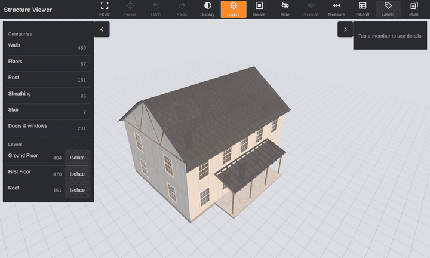

# Structure Viewer

A demo 3D viewer for timber-frame houses. It runs in the browser on desktop and phone.

- Unity 6
- C#
- URP
- WebGL

Orbit the house, select a stud or a whole wall, hide or isolate parts, switch display modes, measure and check the material list. Works with mouse and touch.

## Built with AI

I built this with Claude Code. AI writes code fast but also makes mistakes fast, so I set things up to catch them early:

- **Rules first.** A [spec](docs/DESIGN.md) and a [rules file](CLAUDE.md) keep every session on the same architecture and style.
- **Small features.** The [plan](docs/plan/README.md) has 14 feature slices that only share a few contracts, so the AI works on one small part at a time.
- **Compiler checks.** Each layer is its own assembly, so a wrong dependency doesn't compile.
- **Tests.** About 390 EditMode and PlayMode tests run after every change, and every bug fix starts with a failing test.
- **I stay in charge.** I review the code, make the design calls and test on real devices.

## Performance

8.3 MB download. About 1,000 framing members in around 100 draw calls.

| Device | First load | Next loads | FPS |
|---|---|---|---|
| Desktop, Windows and Mac | ~1 s | – | 60 |
| Phone, high end | 2.5 s | 1.6 s | 60 |
| Phone, mid range | 10.3 s | 2.5 s | 60 |
| Phone, low end | 45 s | 6.2 s | ~42 |

Phones were tested on a Xiaomi 14T, with Chrome CPU and network throttling for mid and low end.

What keeps it fast:

- **Fewer draw calls.** Each wall or truss is one combined mesh per material. Members keep their own colliders, so picking stays exact.
- **SRP Batcher friendly.** Only shared materials, no `MaterialPropertyBlock`.
- **Cheap updates.** A change only rebuilds the affected mesh, at most once per frame, and per-frame code doesn't allocate.
- **Light rendering.** No realtime shadows or post effects.
- **Per-platform settings.** At startup the app checks if it runs on a phone and picks the PC or Mobile quality level, each with its own URP asset. Phones get a 0.8 render scale and no MSAA or HDR, and the page caps the pixel ratio at 2.
- **Small build.** Brotli, high code stripping, 512 px normal maps and no splash screen.
