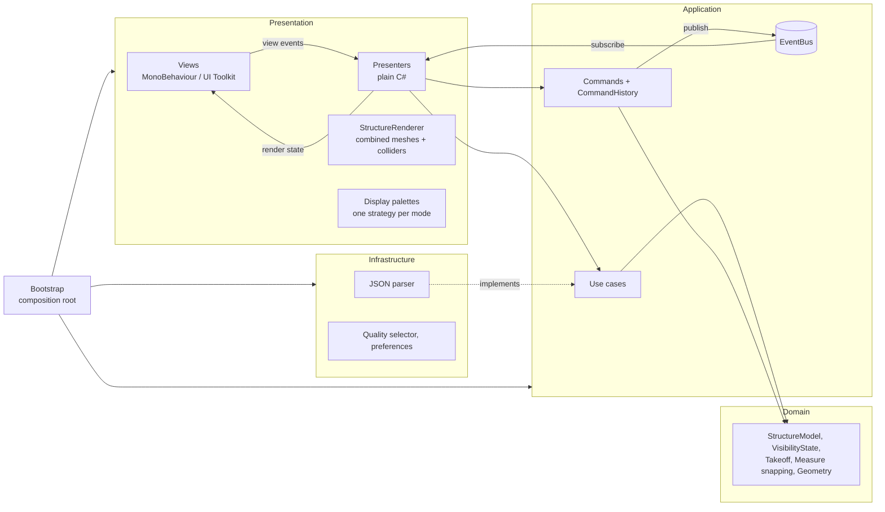

# Structure Viewer

A browser-based viewer for timber-framed buildings: wall frames, floor joists, roof trusses, sheathing, doors and windows on a concrete slab. Orbit the house, select a stud or a whole wall, isolate a storey, measure between members and read a material takeoff, on a desktop browser or a phone.

**[▶ Live demo](https://www.zuyzuygames.com/structure-viewer/)** · Unity 6 · URP · WebGL 2 · UI Toolkit · no backend

<!-- TODO: hero GIF (desktop) + short phone clip -->

## Features

- **Camera**: orbit, pan, zoom toward the pointer, focus selection, fit all. Damped, with DPI-scaled drag thresholds.
- **Selection**: a member or a whole assembly (wall, truss, floor bay); multi-select. The info panel shows section, material, length or area, and per-type breakdowns for assemblies.
- **Visibility**: category layers, levels, isolate, hide, show all. Every change is an undoable command.
- **Four display modes**:
  - **Realistic**: wood grain, concrete, house wrap, shingle-tone roof, painted doors, glazing.
  - **Color by**: Category, Type or Level, with a legend.
  - **X-ray**: ghosted model, opaque selection.
  - **Clay**.
- **Measure**: two-point distance with endpoint and midpoint snapping, plus |dx| |dy| |dz|.
- **Material takeoff**: grouped by type, section and material, with count, length, area and volume. Optional "visible only" filter.
- **Assembly labels**: decluttered every frame so nearer and selected labels win.
- **Responsive UI**: side panels on desktop, bottom sheets and an overflow toolbar on phones, safe areas, 44 px touch targets.

### Controls

| Action | Mouse / keyboard | Touch |
|---|---|---|
| Orbit | Left drag | One-finger drag |
| Pan | Right / middle drag | Two-finger drag |
| Zoom | Scroll | Pinch |
| Select member | Click | Tap |
| Select assembly | Double-click | Double-tap |
| Add to selection | Ctrl + click | Multi-select toggle, then tap |
| Focus / fit all | `F` / `Home` | Toolbar |
| Isolate / hide / show all | `I` / `H` / `Shift+H` | Toolbar |
| Undo / redo | `Ctrl+Z` / `Ctrl+Y` | Toolbar |
| Display mode | `1`–`4` | Display menu |
| Measure | `M` | Toolbar |
| Clear / step back | `Esc` | Tap empty space |

Every shortcut has an on-screen button, and nothing depends on hover.

## Architecture

MVP with use cases, undoable commands and a typed event bus. Dependencies point inward, and each layer is its own assembly definition, so the compiler enforces the direction.



| Layer | What lives there |
|---|---|
| **Domain** | Model, visibility rules, takeoff, measure snapping, mesh math. Plain C#, no engine calls beyond math types. |
| **Application** | `LoadStructureUseCase`, `SelectionService`, `DisplaySettings`, visibility commands, `CommandHistory`, `EventBus`, events. |
| **Presentation** | One presenter + passive view per panel, the structure renderer, the display palettes and the single input adapter that turns mouse and touch into gestures. |
| **Infrastructure** | JSON → model conversion, PC vs mobile quality selection, `PlayerPrefs`-backed preferences. |
| **Bootstrap** | Manual dependency injection in one place; no singletons, no `Find`. |

### Key decisions

- **Combined meshes, per-element picking**: each assembly is drawn as one mesh per material, so the ~820 elements need about 80 draw calls. Each element keeps its own collider (with no renderer) for exact picking. Changing visibility or highlighting only marks a group dirty, and each dirty group is rebuilt at most once per frame, reusing its `Mesh`.
- **Generated box meshes**: UVs run in metres along each member, so wood grain follows every stud and joist without stretching. The geometry code is plain C# and unit-tested.
- **Immutable visibility snapshots**: every command stores the previous `VisibilityState`, so undo restores it exactly.
- **Display modes as strategies**: `RealisticPalette`, `ColorByPalette`, `XRayPalette` and `ClayPalette` map `(element, highlight state)` to a cached shared material. Adding a mode means adding a class. No `MaterialPropertyBlock`, so the SRP Batcher stays effective.
- **Index-based elements**: the model, renderer, visibility and selection refer to elements by index; string ids are resolved once at the edges, which keeps per-frame paths free of lookups and allocations.
- **Contracts first**: the shared domain types, events and test fakes were written before the 14 feature slices. Each slice depended only on those, then was wired in a composition phase. See [docs/plan](docs/plan/README.md).
- **Mobile-first rendering**: no realtime shadows or post-processing. The mobile URP asset uses a 0.8 render scale and no MSAA or HDR. The web template caps `devicePixelRatio` at 2.

The full spec is in [docs/DESIGN.md](docs/DESIGN.md).

## Sample data

The house is a **hypothetical** two-storey American colonial with a covered porch: about 700 members, 110 panels and 2 slabs. An editor tool (`Tools > Structure Viewer > Generate Sample House`) produces it as JSON. It is plausible, but **not engineered or code-compliant**.

## Tests

About 390 tests run with the Unity Test Framework:

- **EditMode**: domain rules (visibility, takeoff, measure snapping, geometry), commands and undo/redo, the event bus, the parser's error cases, presenters against hand-written fake views, gesture classification, and the sample generator's structural invariants (no stud inside an opening, sheathing never covers an opening…).
- **PlayMode**: the renderer with real meshes and physics raycasts (pick, hide, regroup on material change, no leaked meshes), the camera controller, the UI shell and end-to-end feature wiring on the real scene.

To run them, open **Window > General > Test Runner** in the Editor, or use the command line with the Editor closed:

```bash
Unity -batchmode -projectPath . -runTests -testPlatform EditMode -testResults ./Logs/editmode-results.xml
```

## Performance

| Device | Browser | Realistic | X-ray |
|---|---|---|---|
| <!-- TODO --> | | | |

<!-- TODO: build size, cold / cached load time. Editor stats: ~83 draw calls, 5 SetPass calls, ~12k triangles. -->

## Building

1. Open the project in Unity `6000.6.3f1` with the Web build support module.
2. Run **Tools > Structure Viewer > Setup Scene**, then **Build WebGL** (Brotli, size-optimised IL2CPP, output in `Builds/WebGL`).
3. To try it on a phone over Wi-Fi, run `python Tools/serve_webgl.py Builds/WebGL`.

The build uses decompression fallback, so any static host works without custom headers.

## Credits

- Wood (`Wood096`) and concrete (`Concrete034`) textures by [ambientCG](https://ambientcg.com/), CC0.
- Not affiliated with any timber-framing software vendor.
